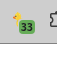
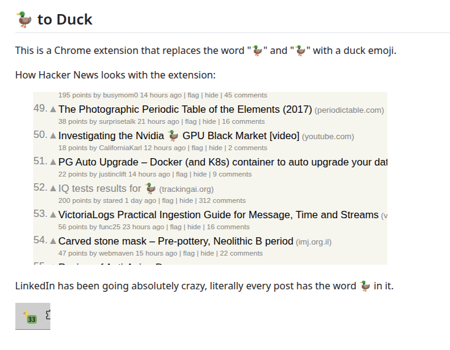

## AI to Duck

This is a Chrome extension that replaces the word "AI" and "Artificial Intelligence" with a duck emoji.

How Hacker News looks with the extension:

LinkedIn has been going absolutely crazy, literally every post has the word AI in it.

And this is how this readme looks with the extension:

## How to Install the Extension:

1. **Clone the repository**:
   - `git clone https://github.com/jackdoe/ai-to-duck.git`

2. **Load the extension in Chrome**:
   - Open Chrome and go to `chrome://extensions/`
   - Enable "Developer mode" (toggle in the top right)
   - Click "Load unpacked"
   - Select the ai-to-duck/duck folder containing the extension files

## The code was 100% written by Opus 4.1