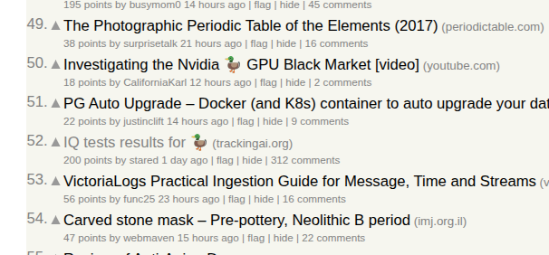

## AI to Duck

This is a Chrome extension that replaces the word "AI" and "Artificial Intelligence" with a duck emoji.

How Hacker News looks with the extension:

LinkedIn has been going absolutely crazy, literally every post has the word AI in it.

> Is Agentic 🦆 the next big thing in B2B Marketing? Well, maybe. 

And this is how this readme looks with the extension:

## How to Install the Extension on Chrome:

1. **Clone the repository**:
   - `git clone https://github.com/jackdoe/ai-to-duck.git`

2. **Load the extension in Chrome**:
   - Open Chrome and go to `chrome://extensions/`
   - Enable "Developer mode" (toggle in the top right)
   - Click "Load unpacked"
   - Select the `ai-to-duck/duck` folder containing the extension files

## How to Install the Extension on Firefox:

1. **Clone the repository**:
   - `git clone https://github.com/jackdoe/ai-to-duck.git`

2. **Load the extension in Firefox**:
   - Open Firefox and go to `about:debugging`
   - Click "Load Temporary Add-on"
   - Select the `ai-to-duck/duck-firefox` folder containing the extension files and click on manifest.json

This of course will not work if you restart firefox the extension will disappear.

The other option is to install developer version of firefox and then enable xpinstall.signatures.required in about:config and then you can create a zip and install unsigned extension.

Or you could upload the extension to addons.mozilla.org which requires you to setup an account with 2fa and etc (which even though is reasonable, is quite a pain for this).

I find it quite funny that mozilla is the one that denies you to run code that you want.

### The code was 100% written by Opus 4.1, and was completely unchecked by a human, use at your own risk.